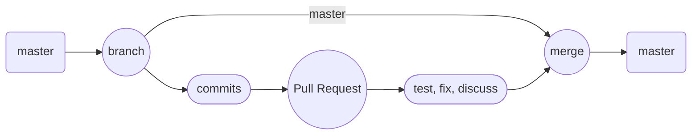

# Feature flow

## Workflow

This project uses
**[GitHub flow](https://docs.github.com/en/get-started/quickstart/github-flow){:target="\_blank"}**
as it's main workflow model. Simplified visualization can be seen on graph
below:



### Creating branch

First let's download latest changes from remote server.

[How to clone git repository](https://docs.github.com/en/repositories/creating-and-managing-repositories/cloning-a-repository){:target="\_blank"}

```
git fetch
```

Make sure we are on `main` branch.

[Record local changes in git repo](https://git-scm.com/docs/git-stash){:target="\_blank"}

```
git checkout main
```

Create new branch for our feature called `feature_name`. `feature/` prefix is
not required but is recommended to distinguish features from fixes and other
types of branches in git history.

```
git checkout -b feature/feature_name
```

Now use git status to make sure everything works as expected

```
git status
```
